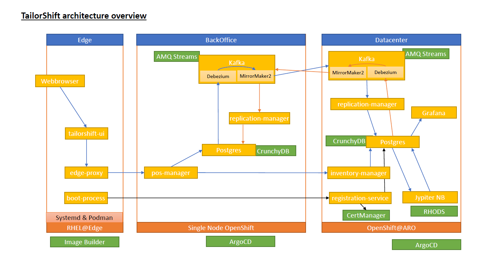
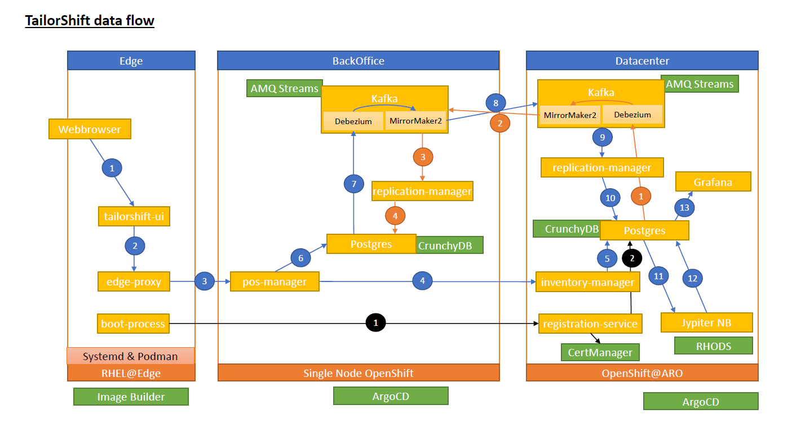

# TailorShift

by Team Atos

## Business Summary

TailorShift is a fashion company with many stores.

Each store is supplied with central master data from the data center, including products with prices, customer data,
employees and PoS devices. Each store has a local back office with an edge server where the global master data is
stored, as well as local data (discounts on products, as well as stock movements and purchase transactions). The
transaction data is replicated back to the data center, where it is available for data science analytics.
A special feature are the secured PoS devices. These have two modes of operation: in normal mode, they serve as an
information system for customers, where they can query information on, for example, stock levels for certain colors and
sizes and even availability in other stores. When a cashier logs on to the system, it acts as a normal checkout system.
The PoS devices communicate only with the local back office. Cryptographic procedures ensure that the PoS devices are
authorized.

## Key features & innovations

### Device cryptographic identity

In our solutions each PoS device gets a custom PKI keypair that is used to identify itself against the backoffice
services. This allows the device to access non-sensitive data or processes by itself. In classic solutions, an identity
must be provided by the user (=cashier) first. In Tailorshift user identity is only
required for checkout transactions. The architecture could be easily extended to support customer self-checkout.

From a greater perspective, the device identity allows offering customer features inside the shop that require a trusted
device, such as current shop prices, marketing offerings or surveys.

### Device dual mode

The edge device is not just a simple point of sale. It can also offer customer-value service such as "what is the price
of?" or "is this product available in other sizes / colors / stores?" features.

Imagine new shop that offers only electronic payment: The device does no longer have to be in a dedicated "
authorized-personnel-only" zone. Instead it could be placed or moved freely around in the shop. This allows making more
efficient use of stores space. Furthermore it allows employees to get closer to the customer, increasing time available
advising and engaging customers in a sale.

### Asynchronous two-way replication

The central datacenter is the owner of certain master data (such as products, prices, customers, employes). Changes to
the master data get asynchronously replicated to each shop.

The shops on the other hand are the data owner of their inventory and sales transactions. Changes here are replicated
back into the datacenter asynchronously.

This effectively decouples shops from the datacenter allowing shops to operate even when no connection to the datacenter
is possible (temporarily). Some activities (e.g. looking up stocks in other shops) can not be covered though, as they
usually require synchronous communication and immediate responses.

The replication of datacenter master data into shops allows adding value-added services on datacenter side via any kind
of web or app services without having to take availibility of the shops into account.

The replication of shop transactional data into the datacenter allows full view on all transactions, furthermore
allowing data science analysis on the full dataset for improved insights.

## Technical Overview

### Architecture overview

Our architecture is covering 3 zones through we data is flowing:

* The PoS Edge device(s)
* The backoffice(s)
* The datacenter

In both OpenShift zones we use ArgoCD to deploy and update all resources an applications.

#### The PoS Edge device(s)

The edge device is running a custom RHEL@Edge image with podman built with image builder.
The applications are configured as systemd service running on podman as docker images. The latest image is pulled on
startup, which simplifies the rollout process of new application versions.
Init scripts in the boot process ensure onboarding with additional PKI assets from the datacenter and setting required
environment variables.

Both running applications are written from scratch and share no code with the example applications.
Communication is completely synchronous via REST. On the ui layer we see a requirement for immediate responses to any
actions, thus there is no asynchronous messaging involved.

`tailorshift-ui` sends all calls following the new pos-manager API contract to the local `edge-proxy`. The edge-proxy
acts as a man-in-the-middle to enhance the frontend calls with cryptographic signatures to verify the devices identity.

Due to our remote development the device is simulated in a VM. Thus we skipped setting up a webbrowser in kiosk mode and
forwarded the ports instead. The ui is simulating barcode scanner input (e.g. scanning product barcodes, employee
authorization cards) by requesting numeric input instead.

#### The backoffice(s)

The backoffice is a single node OpenShift cluster. Due to our remote development we used the provisioned one by Atos.

All data is persisted in a Postges database (provisioned by CrunchyDB). The database schema is managed by Flyway. For
simplified development we use the same schema for both datacenters.

The `pos-manager` is responsible for employee authorization, storing sales transactions, managing the inventory and
product lookup (including stock) locally or even globally (calling the datacenter).

When the `pos-manager` takes requests from the frontend, on each call it verifies the cryptographic headers added
by `edge-proxy`to verify the validity of the device. The headers contain a device id (to lookup the correct public key
in the database), a timestamp (to avoid replay-attacks) and a signature built out of both.

`Debezium` running as a `Kafka` component reads sales transactions and puts them into Kafka messages.
`MirrorMaker2` shifts these over to the datacenter. To export sales transactions safely into the datacenter, the
transaction is stored as a json in a dedicated export table which is inserted in the same sql transaction. This approach
is used to avoid foreign key constraint issues, as a replication of parent/child records via separate message on the
broker could be consumed out of order.

Incoming messages (from the datacenter MirrorMaker2) are processed by the `replication-manager` that takes care of
inserting, updating or deleting master data. Compared to classic database replication, this - in theory - also decouples
the database schemas in both clusters.

#### The datacenter

The datacenter is an OpenShift cluster on ARO (Azure).

As with the backoffice, all data is persisted in a Postges database (provisioned by CrunchyDB). The database schema is
managed by Flyway. For simplified development we use the same schema for both datacenters.

Here, the `replication-manager` is responsible for inserting sales transactions coming from the shops.

This allows the `inventory-manager` to give information about stock in all shops.

Having all master and transaction data in one database, a RHODS `Jupyter Notebook` is used to analyse the data. In our
example we utilized it to make sales forecasts on daily and weekly basis. These are then visualized in `Grafana`.

Once registered as a device in the sql database, the `registration-service` can generate certificates (utilizing
`CertManager`) and handing them to edge devices on startup. The service also listens to changes to device certificates
and populates the pos_device table with the public key. Thanks to the replication logic, the publiy key is then
replicated into the shop, where it is used to verfiy requests.

### Implemented processes and data flow

The diagram below visualizes the flow of data through the processes that we explain in detail:

Black: The device setup flow \
Red: The master data flow \
Blue: The user interaction flow

#### Black: The device setup flow

* (1) On boot of the Edge device, a local script is started that requests a keypair from the registration-service by
  sending its own device id.
* (2) If the device id is known (configured as pos device in the postgres database) it will generate a new certificate
  signed with the TailorShift-CA via CertManager (assuming no certificate exists yet). The public key pair is returned
  to the edge device, and the public key is stored for the pos device in postgres where it will be replicated via the
  master data flow back to the backoffice.

#### Red: The master data flow

The datacenter holds master data for multiple objects: shops, pos devices, products customers and employees.

* (1) If any changes occur to the data (assuming access from outside applications), Debezium will collect these changes
  and publish them on the Kafka cluster in the datacenter.
* (2) MirrorMaker2 will copy these messages to the BackOffice kafka cluster.
* (3) The replication-manager application listens for change messages of the entities named above and
* (4) persists these to the database in the back office.

#### Blue: The user interaction flow

* (1) The Point of Sale device is running the tailorshift-ui website in a kiosk mode webbrowser (not implemented).
* (2) All requests that are targetting the pos-manager need to be passed to the edge-proxy first.
* (3) The edge-proxy takes the original request and extends it with an cryptographic signature in the http headers using
  the private key of the device obtaining during the boot process. The pos-manager validates the headers and cancels all
  requests that can't be verified.
* (4) Some requests (here: querying stock of a certain product in other shops) require knowledge of all stocks. These
  can only be answered by the inventory manager of the database,
* (5) because only the datacenter database knows all transactions of all shops.
* (6) Local requests such as a checkout or a product request can be answered from the local db. On purchase, a receipt
  with positions and inventory movements are persisted in the backoffice database. The receipts along with its positions
  are stored in a dedicated export tables as a JSON to avoid
  foreign key issues on import.
* (7) Insert into the receipt export tables are collected by Debezium and produce a local message in Kafka.
* (8) MirrorMaker2 replicates the message into the datacenter Kafka instance.
* (9) The replication-manager receives the export messages and
* (10) stores the receipt, positions and inventory movements in the datacenter database.
* (11) A data scientist has access to all transactions of all backoffices. He can do sales predictions in a Jypiter
  notebook and
* (12) stores the predictions in tables in the datacenter database.
* (13) The sales predictions are visualized in a Grafana dashboard.

### Other considerations

* The OpenShift clusters are developed as "infrastructure-as-code" and a such managed via ArgoCD. This applies to the
  application resources, as well as custom resources for the cluster operators.
    * The datacenter and the backoffice resources are managed in a monorepo, since the resources are very similar
      anyway.
    * For simplicity each cluster had its own independent instance of ArgoCD.
    * Helm was used for templating the resources for multiple stages (development, prod)
* Quarkus was used for all backend apps
    * Due to the IaC approach, for Quarkus apps we just used the extensions for regular docker images and no particular
      OpenShift features.
    * Docker images where built and pushed directly using the quarkus plugins

### The technology stack

As part of this hackfest we used the following technologies:

* OpenShift ARO cluster (backend) + Single Node OpenShift (backoffice)
* RHEL@Edge + Podman for running service on our PoS device
* CrunchyDB (PG Operator) for deploying Postgres
* AMQ Streams (Strimzi) for deploying Kafka & Kafka Connect clusters and related tooling
* Debezium as a Kafka Connect service to replicate Postgres data
* MirrorMaker2 to move Debezium messages across from backoffice into the datacenter (and vice versa)
* OpenShift GitOps (ArgoCD) for managing our infrastructure as code (deploying applications and resources in the
  cluster)
* OpenShift Data Science for creating sales predictions
* Grafana for visualizing sales predictions
* Cert Manager for setting up a PKI infrastructure and dynamic certificate generation
* Quarkus (with Java) as the only framework for backend application development
* Hibernate and Panache for accessing the database in Quarkus
* Patternfly Seed (with Typescript) for frontend application development
* GitHub for version control
* Flyway for database version control
* Schemaspy for visualizing the database schema (served by GitHub Actions & GitHub Pages)
* Tekton for CI pipelines [1]
* Fido Device onboarding [2]

[1] not finished due to technical issues on ARO cluster \
[2] backend services prepared in OpenShift but not used on edge side due to technical issues

## Loose ends

As per definition of a Hackfest we were working in proof of concept mode. As such we took a few shortcuts, that are not
recommended for production usage / further development. For full transparency we list them here:

* DB: We use a single shared SQL database model across applications and clusters. This actually violates classic
  microservice principles and could cause issues if the complexity raises with more services being added. However, the
  replication logic supports replicating into any (database) structure and is just an implementation detail of the
  replication manager.
* Kafka: We did not optimize the Kafka cluster on the single node OpenShift. There is not much use to run a 3-node
  cluster on a single node. In a real world scenario it would save a lot of compute resources (and probably maintenance)
  to run single node Kafka on single node OpenShift
* Kafka / Debezium: We set up a dedicated Debezium user per Postgres cluster, but for easy of speed did not solve table
  ownership issues, but gave the Debezium user Superuser permissions instead.
* Kafka / MirrorMaker2 required the Kafka clusters to be externally accessible. We did not secure these with proper user
  and permissions.
* Data Science: Our prediction data pipeline in RHODS is "on demand". As we do not know the exact requirements of
  retail (e.g. seasons etc.) we did not set up any automation here.
* Tekton pipelines could not be tested due to issues with the ARO cluster. They may or may not work.
* Quarkus: We did not engage in minifying the resource footprint by utilizing native images. This was mostly done to
  speed up development iterations, as compiling into native images takes a lot of time. Activating native images is just
  one compile flag away!
* Quarkus: We followed the principles of DDD: **Deadline** driven development. As such we skipped writing any kind of
  tests ;)